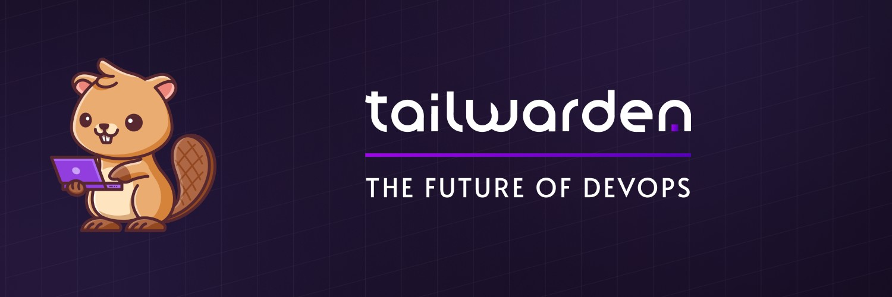

# Tailwarden AWS Lambda API

This project is a Golang implementation of an API that connects to an AWS account and exposes endpoints for managing Lambda functions. The API supports listing all Lambda functions across regions and searching for functions by runtime, tag, and region.



## Prerequisites

Before running the server, you'll need to do the following:

* Install Golang on your machine.
* Set up an AWS account and create an IAM user with programmatic access.
* Configure the AWS CLI on your machine with the IAM user's access key and secret key.
* Install the project's dependencies by running `go mod download` from the project's directory.

## Getting started

To start the server, run the following command from the project's directory:

```
goCopy code
go run main.go
```

By default, the server listens on port 8080. You can change the port number by setting the `PORT` environment variable to a different value.

## Endpoints

The API exposes the following endpoints:

### `GET /functions`

Returns a list of all Lambda functions across regions.

### `GET /functions/search`

Returns a list of Lambda functions matching the given search criteria. The following query parameters are supported:

* `runtime`: Filter functions by runtime environment.
* `tagKey`: Filter functions by tag key.
* `tagValue`: Filter functions by tag value.
* `region`: Filter functions by AWS region.

## Example requests

Here are some example `curl` requests you can use to test the API:

List all functions:

```bash
curl 'http://localhost:8080/functions'
```

Search for functions with the `go1.x` runtime:

```bash
curl 'http://localhost:8080/functions/search?runtime=go1.x'
```

Search for functions with the `my-tag-key` tag and `my-tag-value` value:

```bash
curl 'http://localhost:8080/functions/search?tagKey=my-tag-key&tagValue=my-tag-value'
```

Search for functions in the `ap-southeast-2` region:

```bash
curl 'http://localhost:8080/functions/search?region=ap-southeast-2'
```

## CI/CD

This project includes a GitHub Actions workflow, `.github/workflows/main.yml`, that sets up a CI/CD pipeline for the API. The pipeline consists of the following steps:

1. Checkout code from GitHub.
2. Install Golang and project dependencies.
3. Run tests.
4. Build the API binary.
5. Deploy the API to AWS Lambda using the Serverless Framework.

To set up the pipeline, you'll need to do the following:

1. Create a new workflow file, `main.yml`, in the `.github/workflows` directory of your GitHub repository with the following contents:

```yaml
name: CI/CD

on:
  push:
    branches:
      - main

jobs:
  build:
    runs-on: ubuntu-latest

    steps:
      - name: Checkout code
        uses: actions/checkout@v2

      - name: Set up Go
        uses: actions/setup-go@v2
        with:
          go-version: '1.16'

      - name: Install dependencies
        run: go mod download

      - name: Run tests
        run: go test -v ./...

      - name: Build API binary
        run: go build -o bin/aws-lambda-api

      - name: Deploy API
        uses: serverless/github-action@v1.1.0
        with:
          args: deploy -v
        env:
          AWS_ACCESS_KEY_ID: ${{ secrets.AWS_ACCESS_KEY_ID }}
          AWS_SECRET_ACCESS_KEY: ${{ secrets.AWS_SECRET_ACCESS_KEY }}
```

2. Create the following two secrets in your GitHub repository:

   * `AWS_ACCESS_KEY_ID`: The access key ID for your IAM user.
   * `AWS_SECRET_ACCESS_KEY`: The secret access key for your IAM user.

   You can create these secrets by going to your repository's "Settings" tab, clicking "Secrets", and then clicking "New secret".

3. Add the project to your Serverless Framework dashboard by running `serverless login` and following the prompts.

4. Set the `awsRegion` field in the `serverless.yml` file to `ap-southeast-2` or the region of your choice.

5. Commit the changes to the repository and push to GitHub.

After completing these steps, the pipeline will automatically run whenever you push changes to the `main` branch. The API will be deployed to AWS Lambda and accessible at the URL provided by the Serverless Framework.
